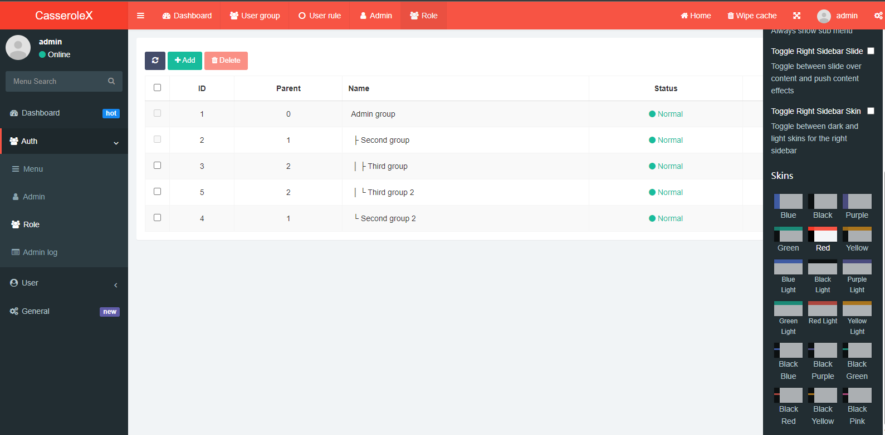

<h1 align="center">
CasseroleX
</h1>

<div align="center">

CasseroleX 是一个使用.net 9清洁架构开发的基于权限管理的后端开发框架.
 
</div>

[](template.png)

[English](README.md) | 简体中文


## ✨ Features

- 支持无限制的管理员权限继承，
- 父级管理员可以随意添加、删除或修改子级管理员和权限设置
- 支持单个管理员的多个角色
- 支持附件上传分类管理
- 支持常规用户组、用户权限和菜单管理
- 使用了清洁架构和CQRS，具有出色的性能和简洁的代码。
 


## 🎉 Technologies

- [ASP.NET Core 9](https://docs.microsoft.com/en-us/aspnet/core/introduction-to-aspnet-core)
- [Entity Framework Core 7](https://docs.microsoft.com/en-us/ef/core/)
- [MediatR](https://github.com/jbogard/MediatR)
- [AutoMapper](https://automapper.org/)
- [FluentValidation](https://fluentvalidation.net/)
- [Serilog](https://github.com/serilog/serilog-aspnetcore)
- [FastAdmin](https://github.com/karsonzhang/fastadmin)
- [Pomelo EntityFrameworkCore MySql](https://github.com/PomeloFoundation/Pomelo.EntityFrameworkCore.MySql) 
 

## 🎨 UI Specification

管理界面使用了 `Fastadmin`，它集成了`AdminLTE`、`Bootstrap`、`jQuery`、`Bootstrap table`、`Layer`等前端框架.在这里对他们表示特别的感谢，使我在UI界面上为节省了很多时间.


## 📦 Installation

使用`Visual Studio 2022`打开项目后，打开`appsettings.json`文件以配置数据库连接。该项目使用`Mysql`数据库。如果使用其他数据库，请更改`Infrastructure`项目下`ConfigureServices.cs`文件中与数据库连接相关的语句

```bash
services.AddDbContext<ApplicationDbContext>(options =>
                options.UseMySql(_connectionString, ServerVersion.AutoDetect(_connectionString)));
```

从根文件夹添加新的迁移：


```bash
 dotnet ef migrations add "InitMigration" --project src\Infrastructure --startup-project src\WebUI --output-dir Migrations
```

如果没有使用Redis 请把 `UseRedisCache` 设置为 false

```bash
"RedisOptions": {
    "UseRedisCache": false, 
    "RedisDataProtectionKey": "",
    "CacheTime": 1440, //min
    "RedisConnectionString": "192.168.0.1:6379",
    "RedisDatabaseId": 2
  }
```

Launch the app:
```bash
cd src/Web
dotnet run
```
  
## ❓ Help from the Community

有关如何使用CasseroleX的问题，请将问题发布到 [issues](https://github.com/Harold-Jiang/CasseroleX/issues)  
 

## ☀️ License

This project is licensed with the [Apache2](LICENSE).


**如果你觉得这个项目有用，请给它打一颗星。谢谢! ⭐**